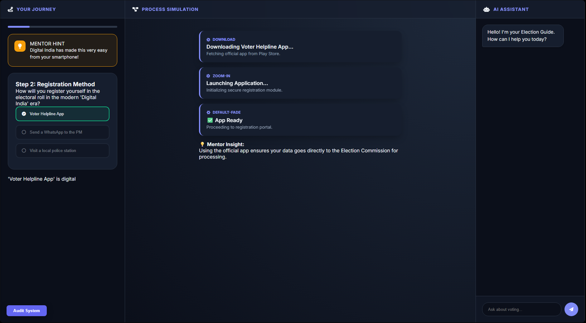
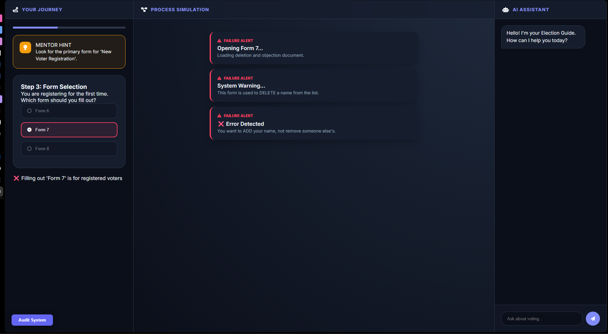
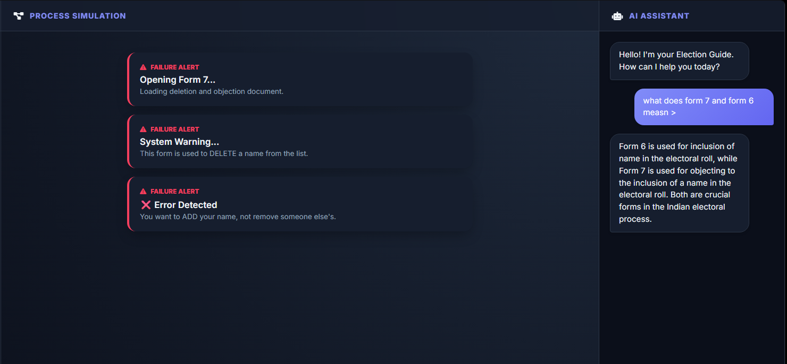
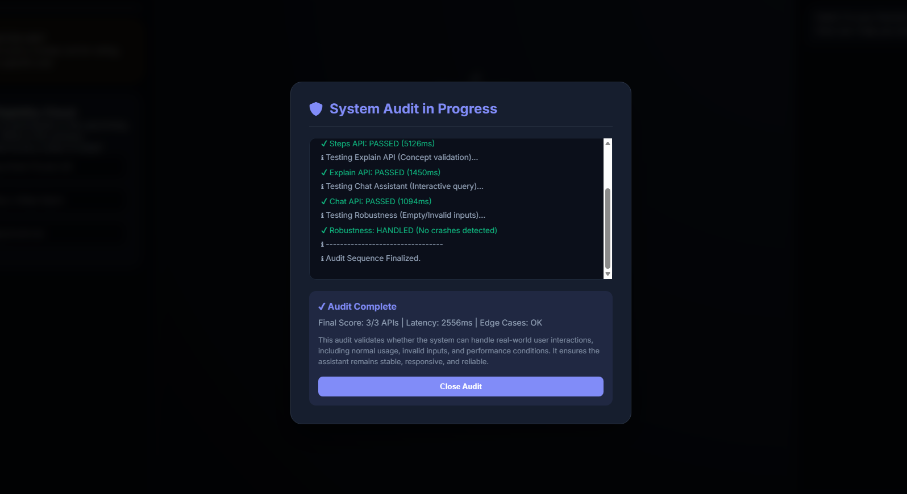

# 🗳️ AI-Powered Electoral System Assistant

🔗 **Live Demo:** https://promptvars-challenge-2.web.app/  
🔗 **Backend API (Cloud Run):** https://election-backend-882610711158.asia-south1.run.app  
🎥 **Demo Video:** https://drive.google.com/file/d/1xUMRhlmsQEpYmTmJMIqTC4hUzk7JhXt3/view?usp=sharing

---

## 📌 Overview

This project is an **AI-driven electoral learning system** built for **Google Prompt Wars – Challenge 2**.

Instead of relying on static guides, the system transforms electoral procedures into an **interactive, decision-driven simulation experience**.

It focuses on helping users understand **why actions matter**, not just what to do.

---

## 🖼️ UI & System Preview


### 🔹 Main Simulation Interface (Correct Answer)


### 🔹 Main Simulation Interface (Wrong Answer)


### 🔹 AI Assistant


### 🔹 Test Cases


---

## 🎯 Problem Statement

Traditional civic systems are:

- Static and text-heavy  
- Lacking real-world simulation  
- Low in user engagement  

This system changes that by enabling:

> **User interacts → makes decisions → sees outcomes → learns from consequences**

---

## 🧠 Core Idea

Each interaction follows a structured loop:

> **User Action → AI Evaluation → Outcome Simulation → Explanation → Retry**

### Example

> **Wrong form selected → system simulates rejection → AI explains correction → user retries**

---

## ⚙️ System Architecture

```text
Frontend (Firebase Hosting)
        ↓
Cloud Run (FastAPI Backend)
        ↓
AI Model (OpenRouter)
        ↓
Firestore (Event Logging) + Firebase Analytics
```

### Flow Explanation

1. **Frontend (Firebase Hosting)**
   - Handles UI, user interactions, and API calls

2. **Backend (Cloud Run – FastAPI)**
   - Processes requests
   - Manages AI prompts and response formatting

3. **AI Layer (OpenRouter Models)**
   - Generates:
     - Steps
     - Explanations
     - Chat responses

4. **Data Layer**
   - **Firestore** → logs user interactions
   - **Firebase Analytics** → tracks user behavior

---


## 🧠 Key Components

### 1. AI Assistant
- Handles open-ended queries  
- Provides contextual guidance  
- Acts as fallback support  

---

### 2. Simulation Engine
- Generates workflows dynamically  
- Evaluates user decisions  
- Simulates real-world outcomes  

---

### 3. Dynamic Question System
- AI-generated realistic options  
- Prevents memorization  
- Encourages reasoning  

---

### 4. Explanation Engine
- Explains why answers are correct/incorrect  
- Guides user toward correct path  

---

### 5. Audit & Testing System 🚀

Built-in system validation feature that checks:

- Steps API  
- Explain API  
- Chat API  
- Edge cases (null/empty inputs)  
- Performance latency  

## 🧪 Sample Output

### 🔹 Steps API Response

```json
{
  "steps": [
    {
      "title": "Visit Official Portal",
      "description": "Go to the official voter registration website.",
      "type": "info"
    },
    {
      "title": "Fill Form 6",
      "description": "Enter personal details for new voter registration.",
      "type": "info"
    },
    {
      "title": "Submit Documents",
      "description": "Upload proof of identity and address.",
      "type": "info"
    },
    {
      "title": "Verification Complete",
      "description": "Your application is under review.",
      "type": "success"
    }
  ]
}
```
---

## 📊 Tracking & Analytics

### 🔹 Firestore Logging

Tracks:

- Step number  
- Selected option  
- Correct/incorrect decision  
- Timestamp  

---

### 🔹 Firebase Analytics

Tracked events:

- `app_loaded`  
- `option_selected`  
- `chat_used`  
- `journey_completed`  

---

## 🧪 Testing Strategy

- Automated API validation  
- Edge case handling  
- Performance observation  
- Retry and fallback mechanisms  

---

## ⚙️ Engineering Principles

### 🔹 Code Quality
- Modular structure  
- Clean API handling  
- Reusable components  

### 🔹 Robustness
- Handles invalid inputs gracefully  
- Prevents system crashes  

### 🔹 Performance
- Optimized API calls  
- Controlled latency  

### 🔹 Security
- API keys managed via environment variables  
- No sensitive exposure  

### 🔹 Accessibility
- Clear feedback states  
- Guided interaction flow  

---

## 📁 Project Structure

```text
project-root/
│
├── Frontend/
│   ├── index.html
│   ├── css/
│   │   └── styles.css
│   ├── js/
│   │   ├── api.js
│   │   ├── main.js
│   │   └── test.js
│   └── assets/
│       ├── simulation-ui.png
│       ├── decision-flow.png
│       └── chat-ui.png
│
├── Backend/
│   ├── app.py
│   ├── ai_engine.py
│   ├── requirements.txt
│   └── Dockerfile
│
└── README.md
```
---

## 🧠 Design Philosophy

> **Understanding comes from interaction, not instruction.**

---

## 💡 Highlights

- Fully AI-driven system  
- Simulation-based learning  
- Dynamic question generation  
- Real-time analytics  
- Built-in audit system  

---

## 🔮 Future Improvements

- Personalized learning paths  
- Multi-language support  
- Advanced analytics dashboard  
- Offline capability  

---

## 🎥 Demo


https://github.com/user-attachments/assets/cd86f40b-a37b-4db2-acc0-f1e183c5d062


---

## 👨‍💻 Author

**Rohan R**
